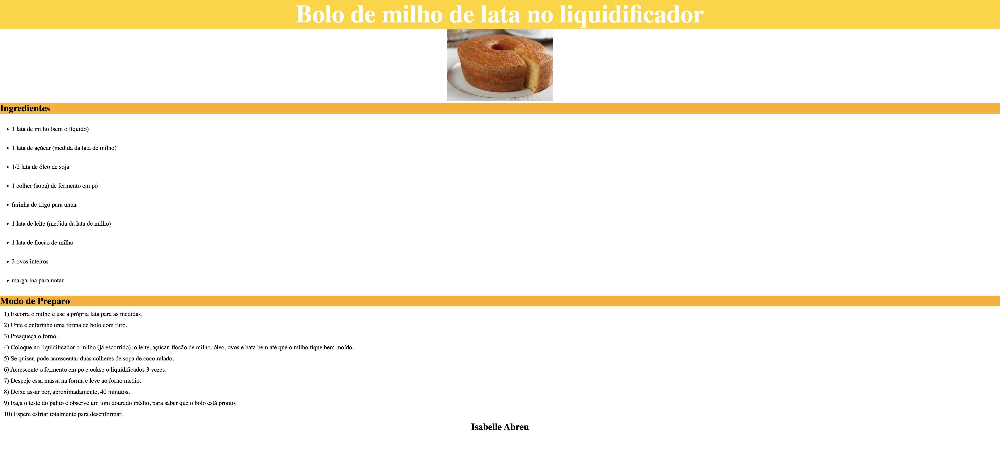

# Receita

## Descrição
Criação de site Receita de bolo passo a passo utilizando HTML E CSS,
desenvolvido durante a disciplina de linguagem de Marcação da escola SENAI Jandira.

## Tecnologias
* HTML
* CSS
* Markdown
* git
& github

## Autor
[Isabelle](https://www.linkedin.com/in/IsabelleAbreuu)